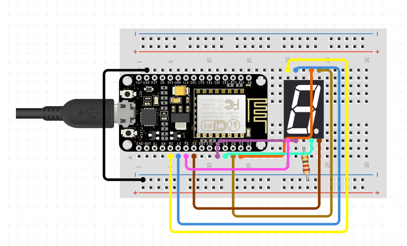

# CPU-METER
CPU Meter using NodeJS backend and view using NodeMCU 7 Segment LED

## How to use 

### Set up CPU-METER

1. On your linux server install `sysstat` package. [(Refer)](https://www.tothenew.com/blog/install-and-configure-sar-on-ubuntu/)

```bashardui
sudo apt-get install sysstat
```

2. Enable monitoring via,

```bash
sudo nano /etc/default/sysstat
```
set

```
ENABLED="true"
```

3. Install `pm2` using 

```bash
npm install -g pm2
```

4. Install `cpu-meter` using 

```bash
npm install --save
```

5. Start `cpu-meter`

```bash
pm2 start 
```

6. Take note of your IP Address (Remember to open port `9000` on your linux server)


### Set up NodeMCU project

1. Open the code via Arduino IDE [(Refer)](https://www.instructables.com/id/Steps-to-Setup-Arduino-IDE-for-NODEMCU-ESP8266-WiF/)

2. Change the `WIFI_SSID` and `WIFI_PASSWORD`

3. Change the `CPU_METER_IP_ADDRESS` to your linux server's IP Address 

4. Import SevSeg package to IDE by downloading [(SevSeg.zip)](https://github.com/DeanIsMe/SevSeg/archive/v3.4.0.zip)

5. Setup your Seven Segment and note down the digitPins from NodeMCU. [(NodeMCU Pinout)](https://randomnerdtutorials.com/esp8266-pinout-reference-gpios/)

6. Upload your code to NodeMCU.

7. Done.



## Acknowledgement

The following references were a tremendous help.

1. https://www.instructables.com/id/Controlling-7-Segment-LED-Display-Using-ESP8266-We/

2. https://www.circuitbasics.com/arduino-7-segment-display-tutorial/

3. https://randomnerdtutorials.com/esp8266-web-server/

4. https://mechatronicsblog.com/esp8266-nodemcu-pinout-for-arduino-ide/

5. https://circuits4you.com/2019/01/11/nodemcu-esp8266-arduino-json-parsing-example/

6. https://electrosome.com/calling-api-esp8266/

7. https://www.instructables.com/id/ESP8266-Parsing-JSON/

8. https://arduinojson.org/v6/doc/upgrade/

9. https://arduinojson.org/v6/assistant/

